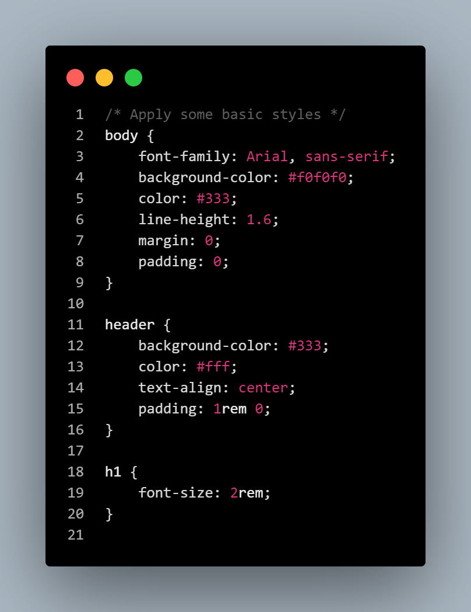
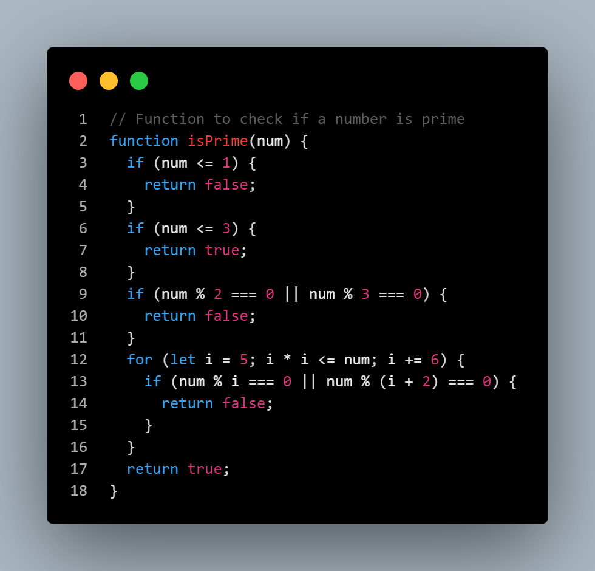
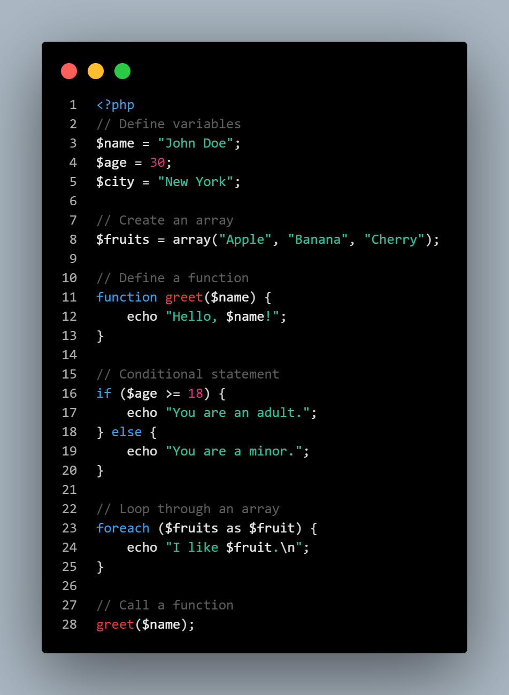
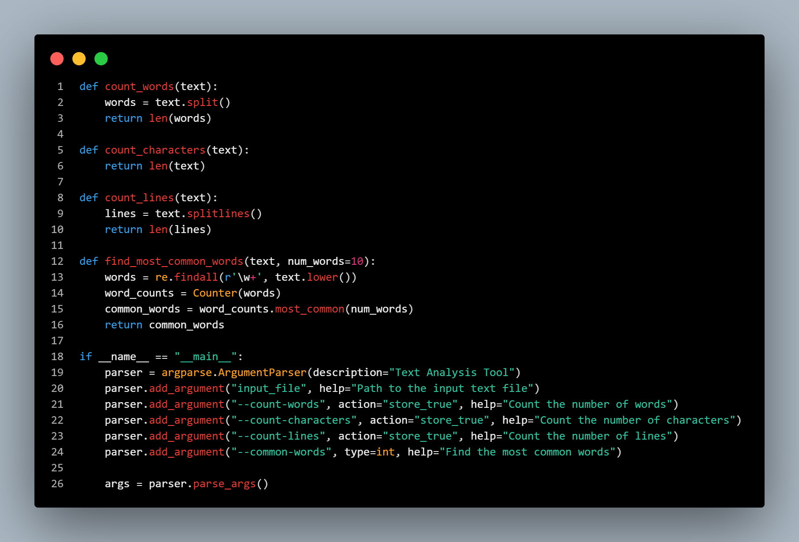

<!-- header area -->
# GPTheme 🧩 <!-- title -->
A theme for VS Code based on the ChatGPT code view *(Windows [10])*. ***LET HIM CODE!!!*** 🍳

<!-- a lil' bit about the experience -->
## Sincere Lines 🥸 <!-- title -->
The whole theme was done hastily by a not so experienced person, so **some imperfections are to be expected**. I made this theme because I searched for it and didn't find anything about, so I thought "If they haven't created it yet, then I can create it...". In short, here are the final result and I hope you **enjoy** the theme as much as I did! Unfortunately, my computer is a **wartime Windows XP 1997**. These writings will not have much visual content in order not to detract from mine and your experience.

<!-- big line break -->
 

<!-- about the theme and his topics -->
## The . . . Theme 🖌️ <!-- title -->
So... the theme is quite simple as you can imagine. It's a code view of ChatGPT but adapted for VS Code. I could even bring some images to illustrate my ideas, but the quality drop is very high. It wouldn't be worth it. Still, I can bring you some important topics that you need to know before downloading the content (references by Initial Release - 0.1.0). [***(Check CHANGELOG News)***](importants/CHANGELOG.md)

<!-- separator -->
---

- ### *Display Reference* 📠 <!-- sub-title -->
*I confess that for now I'm just a programmer with basic knowledge limited to the Python language. If you search for a code, in Java for example, and ChatGPT returns the code with different colors... I think you already understand.*

<!-- separator -->
---

- ### *Expected Colors* ✅ <!-- sub-title -->
*As already said, the theme was based on the ChatGPT display mode, but it appears that this mode is not standard and may change from one device to another... I'm sorry if it doesn't work the way you expected. Furthermore, all colors applied here were measured by eye, meaning some shades may be wrong. Who knows, maybe they will be improved in future versions?* [***(Check CHANGELOG News)***](importants/CHANGELOG.md)

<!-- separator -->
---

- ### *Unexpected Colors* ❓ <!-- sub-title -->
*In fact... not all colors are correct. Unfortunately, ChatGPT doesn't work the same way as most IDEs when it comes to displaying code. For example, the name of functions in Python should be red, but there are still some exceptions such as the "print" function (should be orange). The problem is that (apparently) it is not possible to change the color of a single specific function without changing the others. But that's only for now. Who knows, maybe it won't be able to be resolved in future versions?* [***(Check CHANGELOG News)***](importants/CHANGELOG.md)

<!-- separator -->
---

- ### *Visualization* 🔭 <!-- sub-title -->
*The tones, saturation levels, luminosity and many others directly affect the user's experience when coding. If you have vision problems, this theme could be a nightmare for you. We have some elements that in the standard version of VS Code (Dark C / Dark C++ Theme) are easy to see, but not in this one. The worst thing is that this was the fault of whoever programmed it (me 😵‍💫), and not the IDE or any other tool. About this part, I say the same as the previous parts...* [***(Check CHANGELOG News)***](importants/CHANGELOG.md)

<!-- separator -->
---

- ### *The Font* 👓 <!-- sub-title -->
*I could even change the font. I think "Courier New" would look great, I even tested it! The point is that changing the font unfortunately implies, a lot, a drop in code visualization. It must be a nightmare for those with vision problems. For this and other reasons, I preferred to leave the default font for now* [***(Check CHANGELOG News)***](importants/CHANGELOG.md) *but be aware that it can be changed in your VS Code settings => Font Family: 'Your font', 'Courier New', monospace.*

<!-- separator -->
---

- ### *Some Code Images (From Initial Release - 0.1.0)* 🖼️ <!-- sub-title -->
*Self explanatory:*

<!-- css img -->
- #### *CSS*

<!-- java img -->
- #### *Java Script*

<!-- php img -->
- #### *PHP*

<!-- python img -->
- #### *Python*

If the images aren't loading, check out the repository on [**GitHub!**](https://github.com/pdr-nascimento/GPTheme.git)

<!-- big line break -->
 

<!-- instalation guide -->
## How to Install ⬇️ <!-- title -->
There are two different ways (as far as I know) to do this:

**1. From GitHub:** You can download this repository (if it is on GitHub), unzip the folder and paste it into `"user_name/.vscode/extension"`. After that, just open your VS Code, go to the extensions tab, in the *'downloaded sub-tab'* (as if you had downloaded the extension) and select the theme by name `"GPTheme"` as if it were any other extension;

**2. From VS Code Itself:** Open your VS Code, go to extensions tab and search for this theme by name: `"GPTheme"` and author: `"Nasc Ped"` or `"pdr-nascimento"`. Download and enjoy! :^)

<!-- big line break -->
 
 

# WATCH ⛔⛔⛔ <!-- title -->
The most relevant part is already over. From now on, all you will see are some observations and reflections/ideas from me about the project. Stay if you want! 🫡

<!-- ideas -->
## Some Cool Ideas 💡 <!-- title -->

- **Coloring where I shouldn't(?):** As you can see, the html, css codes (and many others, I believe) are not very colorful. Basically, 75% of their color is white, which is in accordance with the proposal (display via ChatGPT is the same way). In my opinion, there is no problem at all, but there is always room for improvement. I would like to bring a project that is beautiful and enjoyable for everyone, even if it doesn't follow 100% of the references.

- **Implement a light version of the theme:** I believe this will be very difficult. The GPT theme is characterized by a dark background with high contrast and saturation in the editor text. Creating a theme that abandons these principles in order to embrace a new one would be like creating a theme from scratch. It would be like two different themes and not two branches of the same tree. It's worth trying.

- **Implement a color blind friendly version:** Honestly, I think that of the three that have already been mentioned, this topic is the most difficult. It's not just based on writing code to fix bugs or changing fonts, but on studying and understanding the condition of these people. I don't know if I'll be able to implement this. It looks really cool, but I have no idea how to do it. 🥴

<!-- boring text about my inexperience -->
## What I'm sorry to say 🥺 <!-- title -->
I'm not a great internet developer or designer. I'm just a **computer student**. I made this theme about a week ago and brought it here precisely to help people like me, people like you. Maybe I'm putting too much expectation on something so simple, but I want people to **use it**, to **enjoy using it**, **help me improve**, but **I'm not sure if I can make it**. Little by little I'm diving into programming and this GitHub/VS Code/Azure DevOps environment that I just discovered, and tomorrow, who knows, maybe I’ll bring ***some news***? ☀️

<!-- to avoid rights problems -->
## Before it's too late 🤓 <!-- title -->
Before anything else, I would like to remind you that the styles and many others... none of this was my idea or my responsibility. All these things are thanks to [**ChatGPT 🤖**](https://openai.com/blog/chatgpt) and [**Microsoft 🪟**](https://www.microsoft.com/), as well as ***their respective developers*** 🧑‍🔬. The only thing I was responsible for was bringing the product ready, but I didn't even do that alone. I used the [**Yo Code - Extension Generator**](https://vscode-docs.readthedocs.io/en/stable/tools/yocode/) and the [**VS Code Theme Editor**](https://themes.vscode.one/) web tool...

<!-- license -->
## License ✍️ <!-- title -->
If you are curious about the license, access it by clicking [**here!!!**](LICENSE.txt)

<!-- special thanks -->
## Special Thanks 🫂
Special thanks to **Coder Coder** for the video [**How ​​to make your own VS Code theme!**](https://youtu.be/pGzssFNtWXw?si=DFb8mRE0xwji6w3G) and **Christian Lempa** for the video [**Create a VS Code theme + publish on marketplace!**](https://youtu.be/OikulYVz5ZM?si=fpgMgiUrpXFUDEwP). I did the entire project alone, but without these two, I probably wouldn't have done it.

<!-- last one -->
## Final Words <!-- title -->
Honestly, I feel like there are many other things I could and should say or do, but as I already said, I'm just a beginner in the features of Git, its respective website and programming as a whole.
So, that's it for now.   **`Enjoy and take care!`** 🍂